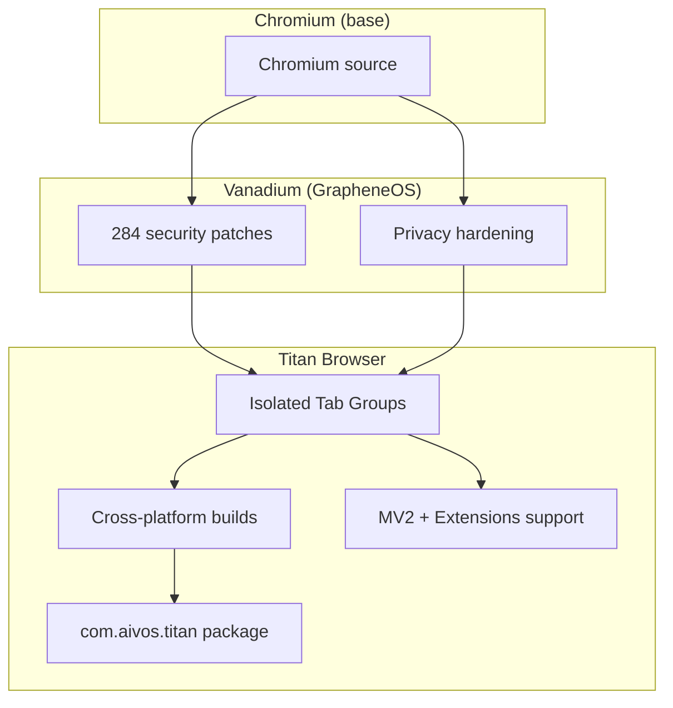

# Titan Browser

[](https://github.com/ferelking242/titan-browser)
[](https://github.com/ferelking242/titan-browser/releases)
[](LICENSE)
[](https://github.com/ferelking242/titan-browser/actions)

**A secure, fully open-source Chromium-based browser with Isolated Tab Groups — available on Android, Linux, Windows, and macOS.**

Built on [Vanadium](https://github.com/GrapheneOS/Vanadium) by [GrapheneOS](https://github.com/GrapheneOS), extended with Titan's signature privacy and isolation features.

Package ID: `com.aivos.titan`

---

## ✨ Key Features

### 🔒 Isolated Tab Groups *(Titan exclusive)*
Each isolated group runs in its own independent Chromium profile — complete data isolation with **zero sharing** between groups or the main profile:

| Data | Main Profile | Isolated Group A | Isolated Group B |
|------|:---:|:---:|:---:|
| Cookies | ✅ | 🔒 own | 🔒 own |
| LocalStorage | ✅ | 🔒 own | 🔒 own |
| IndexedDB | ✅ | 🔒 own | 🔒 own |
| Cache | ✅ | 🔒 own | 🔒 own |
| Service Workers | ✅ | 🔒 own | 🔒 own |
| Passwords | ✅ | 🔒 own | 🔒 own |
| History | ✅ | 🔒 own | 🔒 own |
| Downloads | ✅ | 🔒 own | 🔒 own |
| Permissions | ✅ | 🔒 own | 🔒 own |

**Example — Multi-account Netflix:**
```
Main profile          → Netflix (personal account)
Isolated Group A      → Netflix (work account)     ← no data shared with main
Isolated Group B      → Netflix (family account)   ← no data shared with A or main
```

### Where to find Isolated Tab options
Every entry point in the browser exposes the isolated tab option:

| Location | Action |
|----------|--------|
| Long-press / right-click any link | **Open in isolated tab** |
| Tap "+" button | **New isolated tab** |
| Tab switcher → tab menu | **Move to isolated group** |
| Tab group creation dialog | **Create isolated group** |
| Tab list editor (multi-select) | **Move to isolated group** |
| Browser menu (⋮) | **New isolated tab** |

### 🛡️ Security & Privacy
- All 284+ [Vanadium/GrapheneOS](https://github.com/GrapheneOS/Vanadium) security patches
- Strict site isolation enabled by default
- MV2 extensions supported
- Off-store extension installation (Chrome Web Store, Opera, Edge add-ons)
- Extensions work in private/incognito tabs
- WebRTC IP policy control
- Disabled: metrics, field trials, contextual search, hyperlink auditing
- Local password manager (no Google account required)

### 🖥️ Cross-Platform
| Platform | Status | Architecture |
|----------|--------|-------------|
| Android | ✅ Available | arm64-v8a, armeabi-v7a |
| Linux | ✅ Available | x86_64 |
| Windows | 🔧 Build available | x86_64 |
| macOS | 🔧 Build available | arm64, x64 |

---

## 📦 Installation

### Android
[](https://github.com/ferelking242/titan-browser/releases/latest)

### Linux
```bash
# Download the latest release
wget https://github.com/ferelking242/titan-browser/releases/latest/download/titan-browser-linux-x64.tar.gz
tar -xzf titan-browser-linux-x64.tar.gz
./titan-browser
```

### Windows / macOS
Download from [Releases](https://github.com/ferelking242/titan-browser/releases).

---

## 🔧 Building

### Android (via GitHub Actions)
All releases are built using [Actions](https://github.com/ferelking242/titan-browser/actions).

**Fast build (arm64 only, ~1 hour):**
→ Actions → **Build Android** → Run workflow → arch: `arm64-only`

**Full build (arm + arm64, ~2 hours):**
→ Actions → **Build Android** → Run workflow → arch: `arm+arm64`

**Required secrets** (Settings → Secrets → Actions):
| Secret | Description |
|--------|-------------|
| `LOCAL_TEST_JKS` | base64-encoded `local.properties` (keyAlias, keyPassword, storePassword) |
| `STORE_TEST_JKS` | base64-encoded `keystore.jks` |

### Linux / Windows / macOS
Use the dedicated workflows in [Actions](https://github.com/ferelking242/titan-browser/actions) with a self-hosted runner on the target OS.

### Verify builds
```shell
gh attestation verify *.apk -R ferelking242/titan-browser
```

---

## 🏗️ Architecture



**Implementation detail:** Isolated Tab Groups use Chromium's native `OTRProfileID.createUnique()` API — not a simulation. Each group gets a true independent `Profile` → `BrowserContext` → `StoragePartition`.

---

## 📄 Credits

Built on the incredible work of:
- [GrapheneOS Vanadium](https://github.com/GrapheneOS/Vanadium) — security & privacy patches
- [Chromium](https://chromium.org) — the browser engine
- All original Vanadium contributors

---

## 📜 License

GPL-2.0 — see [LICENSE](LICENSE).
